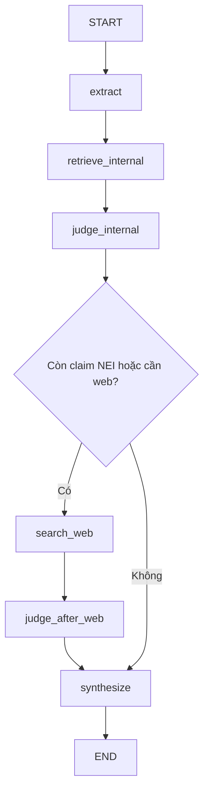

# 🤖 Kiến Trúc & Hướng Dẫn FakeGuard Agent

Tài liệu này trình bày tổng quan cách thức hoạt động của mô hình Agentic RAG cho FakeGuard và mô tả chi tiết kiến trúc thư mục. Agent đóng vai trò như một "Điều tra viên AI", nhận tin đồn, tự phân rã, tự tìm kiếm bằng chứng và đưa ra phán quyết cuối cùng.

---

## 🎯 1. Tổng Quan Các Bước Hoạt Động Của RAG LLM

Quy trình kiểm chứng một bài báo/tin đồn hiện chạy theo **batch workflow** do LangGraph điều phối:



1. **Bước 1: Extract**
   - Node `extract` nhận văn bản đầu vào, tóm tắt, xác định `category`, trích xuất `global_entities` và tách bài thành các `sub_claims`.
   - Mỗi sub-claim giữ thêm `entities`, `time_refs`, `needs_web`, `priority` để các node sau dùng lại.

2. **Bước 2: Kiểm chứng Lớp 1 - Nội bộ (RAG Retriever)**
   - Node `retrieve_internal` truy xuất evidence cho toàn bộ sub-claims bằng Vector Search + Entity Keyword Search + RRF.
   - Node `judge_internal` gọi LLM một lần để đánh giá tất cả claims dựa trên `kb_evidence`.
   - Mỗi claim nhận 1 trong 3 trạng thái:
     - ✅ **SUPPORTED** (Tin chuẩn)
     - ❌ **REFUTED** (Tin giả)
     - ⚠️ **NEI** (Not Enough Information - Không đủ thông tin)

3. **Bước 3: Kiểm chứng Lớp 2 - Internet (Web Search)**
   - Nếu còn claim **NEI** hoặc `needs_web=True`, node `search_web` gọi Tavily API để tìm evidence mới.
   - Node `judge_after_web` chỉ judge lại các claim còn NEI, không ghi đè claim đã chốt.

4. **Bước 4: Tổng hợp & Phản hồi (Synthesizer)**
   - Node `synthesize` không gọi LLM. Nó tổng hợp `final_verdict`, `confidence`, `explanation` và `sources` từ kết quả từng claim.

---

## 📂 2. Cấu Trúc Thư Mục Hệ Thống

Dưới đây là thiết kế kiến trúc cho folder `agent/`, tuân thủ chuẩn chia tách Logic và Tool của LangGraph:

```text
backend/app/agent/
│
├── README.md               # Tài liệu kiến trúc và luồng hoạt động
├── __init__.py
├── config.py               # Quản lý API Keys, config LLM, Tavily
├── state.py                # Định nghĩa AgentState (Pydantic/TypedDict) truyền giữa các Node
├── graph.py                # File cấu hình StateGraph của LangGraph, kết nối các Node
│
├── core/
│   ├── __init__.py
│   └── prompts.py          # Nơi lưu trữ tập trung MỌI Prompt (System Prompts)
│
├── tools/                  # Các công cụ mở rộng năng lực cho AI
│   ├── __init__.py
│   └── searcher.py         # Code tích hợp API tìm kiếm Internet (Tavily/Google)
│
└── nodes/                  # Các "Trạm kiểm soát" (Node) trong đồ thị LangGraph
    ├── __init__.py
    ├── extract.py          # Tóm tắt + tách sub-claims + entity/category
    ├── retrieve_internal.py # Truy xuất evidence nội bộ từ PostgreSQL + pgvector
    ├── judge.py            # judge_internal + judge_after_web
    ├── search_web.py       # Wrapper gọi Tavily theo từng claim cần web
    └── synthesize.py       # Tổng hợp verdict cuối bằng rule
```

---

## 🚀 3. Tình Trạng Hiện Tại Và Bước Tiếp Theo

### Đã hoàn thành

1. **Hoàn thiện graph LangGraph**
   - `extract -> retrieve_internal -> judge_internal -> search_web -> judge_after_web -> synthesize`
   - Có router tự động bỏ qua Tavily khi không cần web evidence.

2. **Hoàn thiện node kiểm chứng**
   - `extract.py`, `retrieve_internal.py`, `judge.py`, `search_web.py`, `synthesize.py` đã hoạt động.
   - Đã tinh chỉnh thêm cho claim tương lai, tin đồn, chuyển nhượng, typo entity phổ biến.

3. **Tích hợp backend API**
   - `POST /api/chat`
   - `POST /api/chat/stream`

### Các bước tiếp theo

1. **Kết nối frontend**
   - Gửi input từ giao diện sang `/api/chat`.
   - Hiển thị verdict, confidence, sub-claims và sources.

2. **Tiếp tục tinh chỉnh retrieval/judge**
   - Cải thiện nguồn web theo từng môn và từng loại claim.
   - Tăng chất lượng source được chọn trong response cuối.

3. **Bổ sung bộ claim đánh giá**
   - Tạo danh sách claim mẫu `SUPPORTED / REFUTED / NEI` để test regression sau mỗi lần chỉnh prompt/node.

### Kiểm thử

```bash
cd backend
python -X utf8 test_graph.py
python -X utf8 test_graph_with_real_services.py --stage full
python -X utf8 test_extract.py
python -X utf8 test_judge.py
python -X utf8 test_synthesize.py
python -X utf8 test_search_web.py
python -X utf8 test_rag.py
python -X utf8 test_chat.py
```
